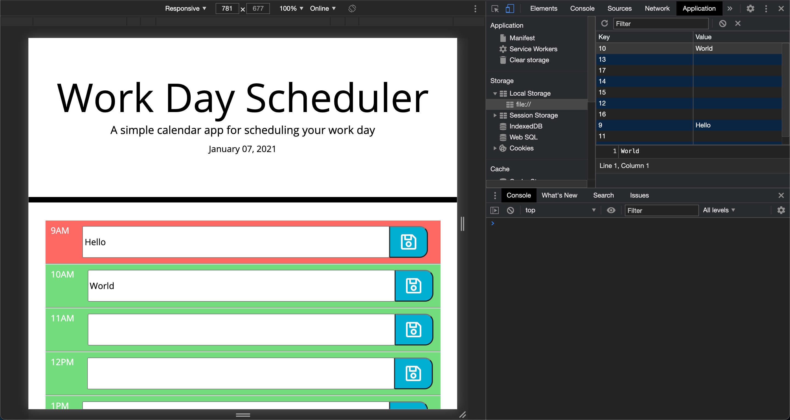

# Workday Scheduler

This repository houses UNC Coding Bootcamp Homework Assignment 5, a simple calendar application that allows a user to save events for each hour of the day. It changes background colors based on the hour, with past hours rendered in grey, the current hour in red, and future hours in green. Data is not deleted upon reload.

It uses:
 
- HTML to create the structure of the app

- CSS to style the app

- JavaScript and jQuery to dynamically update and generate the HTML and CSS as well as adding event listeners

- The day.js library to pull and format the current date

## Link to Deployed Application
This application can be found at https://smlisk0630.github.io/work-day-scheduler/.

## Screenshots

## Credits

- [UNC-Chapel Hill Coding Bootcamp](https://bootcamp.unc.edu/)
- [day.js](https://day.js.org/)
- [Jack Funck, fellow bootcamp student](https://github.com/JFunck1990/HW-5-Third-Party-APIs-Work-Day-Scheduler)
